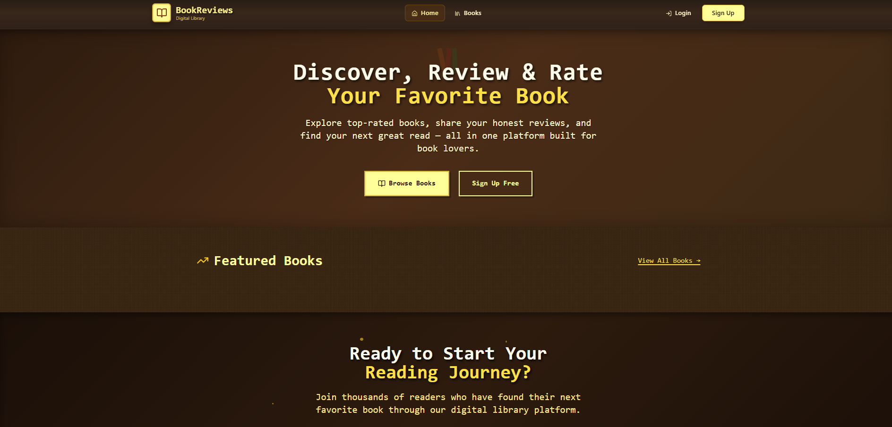
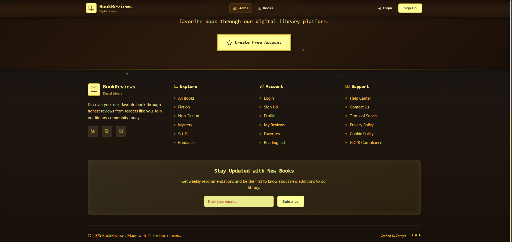
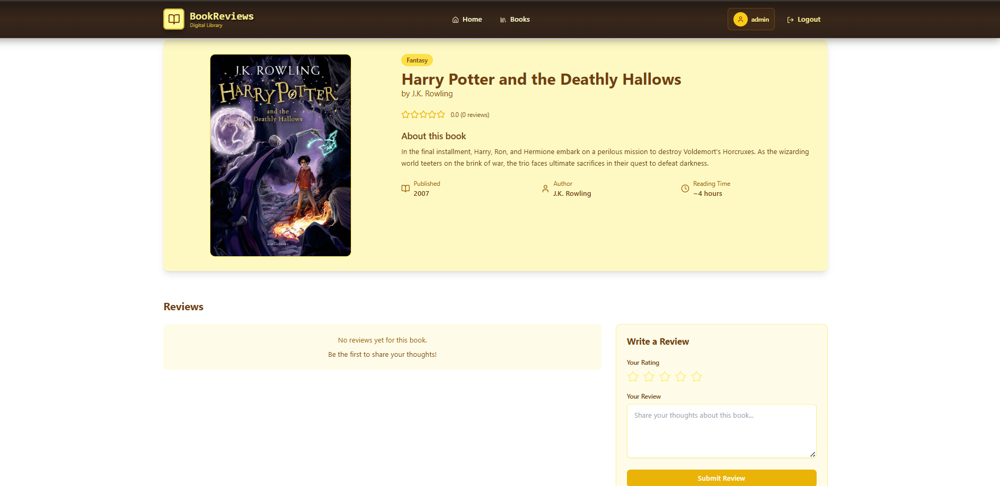
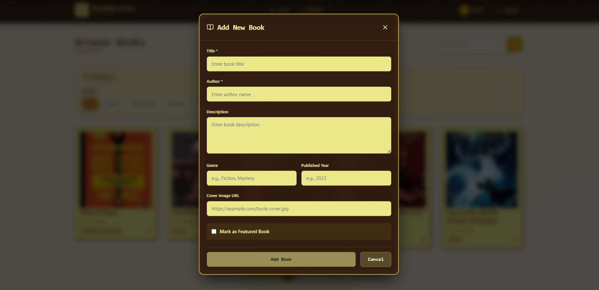
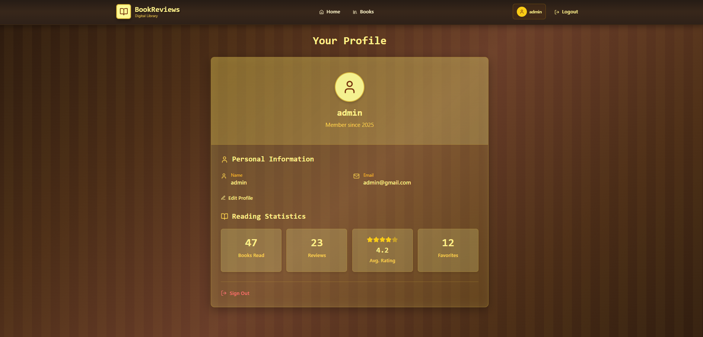
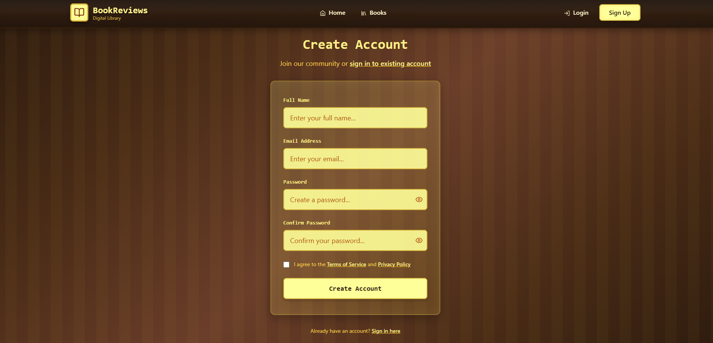

<h1 align="center">BookReviews: A Digital Library/h1>

<p align="center">
  Discover, review, and track your favorite books—all in one place. BookReviews is a modern web app that lets users search for books, share their thoughts, and explore reviews from other readers.
</p>

## 🖥️ Tech Stack
**Frontend:**

&nbsp;
&nbsp;

**Backend:**

&nbsp;
&nbsp;
&nbsp;

**Deployed On:**


## 📌 Key Features:
<dl>
  <dt>🔐 Authentication</dt>
  <dd>Users can sign up or log in to access their personalized book dashboard.</dd>

  <dt>🔍 Book Search</dt>
  <dd>Search books by title or author using a clean, responsive UI.</dd>

  <dt>📝 Add Reviews</dt>
  <dd>Submit reviews for books you've read, including rating and description.</dd>

  <dt>📖 View Details</dt>
  <dd>Check book summaries, cover images, and details before reviewing.</dd>

  <dt>🗂️ Review History</dt>
  <dd>View and manage all reviews you’ve written in a dedicated section.</dd>

  <dt>🎨 Clean UI</dt>
  <dd>Minimalistic, dark-themed interface for an elegant reading experience.</dd>
</dl>

## 📌 Screenshots:
> **Home Page**  


> **User Dashboard / My Reviews**  


> **Book Details & Review Form**  


> **Book Details & Review Form**  


> **Book Details & Review Form**  


> **Login & Signup**  


> **Login & Signup**  



## 🚀 Getting Started:

Before you begin, ensure you have the following installed on your local machine:

- [Node.js](https://nodejs.org/) (v14 or later)
- [npm](https://www.npmjs.com/) (v6 or later) or [Yarn](https://yarnpkg.com/) (v1 or later)

## 🏠 Running the Project Locally:

Follow these steps to run the Next.js project on your local machine:

1. **Clone the Repository:**

    ```sh
    git clone https://github.com/Zethyst/Digital-Library.git
    cd Digital-Library
    ```

2. **Install Dependencies:**

    Using npm:

    ```sh
    npm install
    ```

    Or using Yarn:

    ```sh
    yarn install
    ```

3. **Run the Development Server:**

    Using npm:

    ```sh
    npm run dev
    ```

    Or using Yarn:

    ```sh
    yarn dev
    ```

4. **Open Your Browser:**

    Open your browser and navigate to [http://localhost:5173](http://localhost:5173). You should see the Next.js application running!

## 📜 License:

This project is licensed under the MIT License.


<h2>📬 Contact</h2>

If you want to contact me, you can reach me through below handles.

[](https://www.linkedin.com/in/akshat-jaiswal-4664a2197)

© 2025 Akshat Jaiswal


[](https://forthebadge.com)
